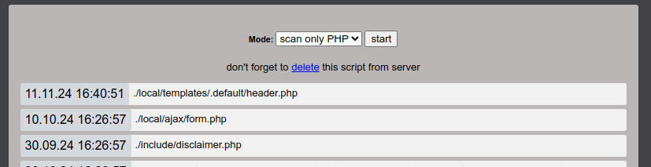

# Scan.php
Простой инструмент сканирования дат изменения файлов на PHP сайтах, размещенных на сервере. Предназначен для веб-мастеров.

  

Позволяет сгенерировать список дат последнего изменения файлов на сервере, относительно корня сайта. Возможно сгенерировать список всех, либо только PHP файлов. Список файлов сортируется по дате и времени, от самого недавнего изменения. Полезен для поиска правок, следов атак, существования файла на сайте.

Поддерживает работу в PHP от 5.4 до 8.3 и новее.

## 🚀 Запуск
В скрипте, в константе "TIMEZONE", укажите корректный часовой пояс для вашего местоположения. Это необходимо для удобства чтения результатов сканирования, т.к. сервер может находиться в другом часовом поясе, относительно вашего.

Файл scan.php загружается в корень сайта, через FTP, SSH или панель хостинга. В браузере вводится ссылка к файлу на сайте в виде https://*адрес сайта*/scan.php?run (вместо "run" можно сохранить в скрипте собственное кодовое слово для запуска)

## 🔎 Сканирование
После запуска интерфейса в браузере, выберите режим сканирования (Все файлы, только PHP файлы). Нажмите "start". По окончанию сканирования, откроется страница с сообщением ниже "Scan completed". Если сканирование продолжится более 50 секунд, сканирование прервется с ошибкой "Scan time has expired!". Это мера, для защиты от нагрузки на сервер. Для снижения нагрузки, попробуйте добавить необязательные директории с список игнорирования. О настройке игнорирования читайте ниже.

## 🔧 Настройки скрипта
В скрипте доступны для настройки:
- список игнорируемых файлов
- список игнорируемых директорий

Списки не доступны через браузер, настройка производится в переменных в скрипте. Это позволяет сохранить их один раз локально в самом файле скрипта, и не настраивать их повторно, при каждой процедуре сканирования.

## 🛡️ Защиты от запуска посторонними лицами
GET параметр ?run необходим для запуска скрипта. Название данного параметра можно переименовать в скрипте, для усиления защиты, константа - "STARTER". Данная мера была добавлена еще и для защиты от индексации файла поисковыми роботами.

Скрипт необходимо удалять с сайта сразу, как только завершите процедуру сканирования, во избежание запуска посторонними лицами. Если скрипт размещен на сервере более суток назад, скрипт перестанет запускаться из браузера и самоудалится, если возможно.
